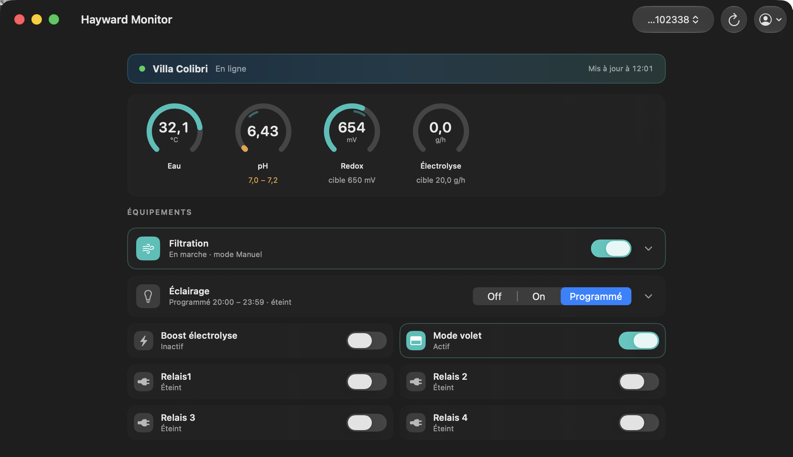

# Hayward Monitor

[](https://github.com/vincentlauriat/HaywardMonitor/releases/latest)
[](#install)
[](LICENSE)

Native macOS app (SwiftUI) to monitor and control a Hayward AquaRite /
Sugar Valley NeoPool swimming-pool system — the same device managed by the
PoolWatch / Vistapool iPhone apps.

**Website: [vincentlauriat.github.io/HaywardMonitor](https://vincentlauriat.github.io/HaywardMonitor/)**



## Features

| Feature | Status |
|---|---|
| Sign in with PoolWatch / Vistapool account (Keychain-stored) | ✅ |
| Live dashboard: temperature, pH, redox, chlorine, electrolysis, WiFi | ✅ |
| Filtration on/off, pump mode & speed | ✅ |
| Pool light with on/off/scheduled selector and time range | ✅ |
| Electrolysis boost, cover mode, aux relays 1-4 | ✅ |
| Setpoints (pH min/max, redox, electrolysis) edited in the gauge's popover | ✅ |
| Auto-refresh (30 s polling) | ✅ |
| In-app auto-update (Sparkle 2, EdDSA-signed, notarized DMGs) | ✅ |
| Menu bar extra, real-time push, history charts | 🔜 |

## Install

1. Download the latest `.dmg` from
   [GitHub Releases](https://github.com/vincentlauriat/HaywardMonitor/releases/latest).
2. Mount it and drag **Hayward Monitor** into `/Applications`.
3. Sign in with your PoolWatch / Vistapool account. Credentials go to the
   macOS Keychain — never to a file.

The app is Developer ID-signed, notarized by Apple, and updates itself via
**Hayward Monitor → Check for Updates…** (Sparkle 2; checks are automatic,
installs always ask first).

Requires macOS 14 (Sonoma) or later.

## How it works

The Hayward Europe cloud is a Firebase project (`hayward-europe`). The app
talks to it directly over REST — no Firebase SDK:

- **Auth**: Google Identity Toolkit (email/password of your PoolWatch account)
- **Reads**: Firestore REST (`pools/{poolId}` document)
- **Writes**: `sendPoolCommand` Cloud Function (WRP operation)

The API key embedded in the source is the vendor's public Firebase *client*
key — the same one that ships inside the official apps; it identifies the
project and grants nothing by itself.

Protocol reference: [aioaquarite](https://pypi.org/project/aioaquarite/) /
[fdebrus/hayward-ha](https://github.com/fdebrus/hayward-ha).
See [ARCHITECTURE_EN.md](ARCHITECTURE_EN.md) (or the
[French version](ARCHITECTURE.md)) for the full design.

## Build from source

```bash
xcodegen generate
xcodebuild -scheme HaywardMonitor -configuration Debug build CODE_SIGNING_ALLOWED=NO
```

Requires macOS 14+, Xcode, xcodegen. Sparkle is resolved automatically via SPM.

## Project layout

```
HaywardMonitor/
├── project.yml                 # xcodegen definition (Sparkle SPM, Info.plist keys)
├── appcast.xml                 # Sparkle 2 update feed (written by release.sh)
├── Scripts/release.sh          # build → sign → notarize → DMG → appcast → GitHub release
├── Scripts/make-icon.swift     # regenerates every AppIcon size + the landing copy
├── docs/                       # landing page (GitHub Pages) + assets
└── HaywardMonitor/
    ├── HaywardMonitorApp.swift     # app entry + Sparkle updater wiring
    ├── Assets.xcassets/            # AppIcon (script-generated, pool theme)
    ├── Models/PoolState.swift      # typed view over the pool document
    ├── Services/
    │   ├── HaywardAPI.swift        # auth + Firestore + commands (actor)
    │   ├── FirestoreDecoder.swift  # Firestore REST envelope decoding
    │   └── KeychainStore.swift
    ├── ViewModels/AppModel.swift   # session, polling, command actions
    └── Views/                      # Login, Dashboard, gauges & device rows
```

## Roadmap

- [x] MVP: dashboard + controls + setpoints (v0.1.0)
- [x] Real-account validation
- [x] App icon, signed & notarized release DMG, Sparkle auto-update (v1.0.0)
- [ ] Menu bar extra
- [ ] Firestore real-time listen (replace polling)
- [ ] History charts & notifications

## Disclaimer

Unofficial project, not affiliated with, endorsed by, or supported by Hayward
or Sugar Valley. It drives *your own* pool through *your own* PoolWatch
account, using the same cloud API as the official apps. Use at your own risk.

## License

[MIT](LICENSE) — © 2026 Vincent Lauriat
